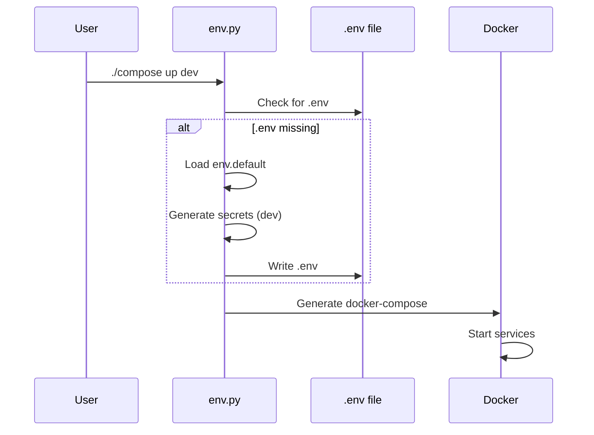

# Eugenius-Docker-n8n

Opinionated, profile-driven Docker orchestration for **local n8n development**, with optional PostgreSQL and **local LLM support via Ollama**.

This repository is designed to give you a **clean, reproducible, zero-SaaS** automation environment that starts working on first boot.

---

## What this project is

- A local-first n8n development stack
- Docker Compose generated programmatically for consistency
- Optional AI sidecar using Ollama (local models, no cloud)
- Profile-based service enablement (dev / heavy / minimal, etc.)

---

## Architecture Overview

```mermaid
flowchart LR
    User[Developer / CI] -->|./compose| Orchestration[Compose Builder (Python)]

    subgraph Docker Network
        n8n[n8n]
        postgres[(Postgres)]
        ollama[Ollama AI]
    end

    Orchestration --> n8n
    Orchestration --> postgres
    Orchestration --> ollama

    n8n --> postgres
    n8n -->|HTTP| ollama
```

---

## What this project is NOT

- A hosted SaaS or managed service
- A Kubernetes or distributed deployment
- A production-hardened security platform out of the box
- A cloud LLM replacement

---

## Quick Start

```bash
git clone https://github.com/<your-org>/Eugenius-Docker-n8n.git
cd Eugenius-Docker-n8n
cp .env.example .env

# Edit required secrets in .env
./compose up dev
```

> On first run, a `.env` file will be generated automatically if one does not exist.

Once started:

- n8n UI: http://localhost:5678
- Ollama API (optional): http://localhost:11434

---

## Startup Lifecycle



---

## Environment Configuration (.env)

The application never reads environment variables directly from the shell.

### Environment Resolution Flow

```mermaid
flowchart TD
    Start[Startup] --> CheckEnv{.env exists?}

    CheckEnv -->|No| LoadDefaults[Load templates/env.default]
    LoadDefaults --> GenSecrets[Generate required secrets
(dev mode only)]
    GenSecrets --> WriteEnv[Write .env file]
    WriteEnv --> EffectiveEnv[Effective Runtime Environment]

    CheckEnv -->|Yes| LoadEnv[Load .env]
    LoadEnv --> EffectiveEnv
```

This project uses a **generated `.env` file** as the authoritative runtime configuration.

### How it works

- `templates/env.default`  
  Contains **safe, non-secret defaults** used to bootstrap configuration.

- `.env`  
  User-owned, **authoritative configuration file** (gitignored).

- `.env.example`  
  Documentation-only reference for all supported settings.

### First run behavior

If **no `.env` file exists**:

1. Defaults are loaded from `templates/env.default`
2. Required secrets are generated automatically (**dev mode only**)
   - `N8N_ENCRYPTION_KEY`
   - `POSTGRES_PASSWORD`
3. A new `.env` file is written to disk

You will see a log message indicating this has occurred.

After this point, `.env` belongs to you and will **never be overwritten automatically**.

### Environment modes

The `ENV_MODE` variable controls behavior:

- `dev` (default)  
  Missing secrets are generated automatically.

- `ci` / `prod`  
  Missing required values cause startup to fail immediately.

This ensures:
- Easy first-run experience for local development
- Safe, explicit behavior for CI and production-like environments

> Do not commit `.env` to version control.  
> Changing `N8N_ENCRYPTION_KEY` after initialization will break stored credentials.

---

## Profiles

Profiles control which services are enabled.

Typical examples:

- **dev**: postgres, n8n, ollama
- **heavy**: postgres, n8n (tuned for stress testing)
- **minimal**: n8n only

Profiles are defined in `orchestration/constants.py`.

---

## Ollama (Local AI)

When the `ollama` service is enabled:

- Ollama runs as a Docker sidecar
- Models are stored in a persistent Docker volume
- A default model (e.g. `llama3`) is automatically pulled on first startup

n8n can access Ollama at:

```
http://ollama:11434
```

### Notes

- Models run **locally** (CPU by default)
- First startup may take time while models download
- Performance depends on your hardware

---

## Data Persistence

The following Docker volumes are used:

- `postgres_data` – PostgreSQL database
- `n8n_data` – n8n configuration and credentials
- `n8n_files` – binary/workflow files
- `ollama_data` – downloaded LLM models

Removing these volumes will reset state.

---

## Diagram Rendering Note

> Mermaid diagrams render fully on GitHub. Some local Markdown previews (e.g., PyCharm) may display simplified shapes.

---

## License

See [LICENSE](LICENSE).
