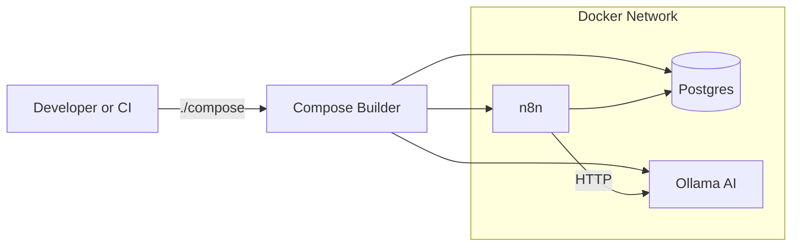
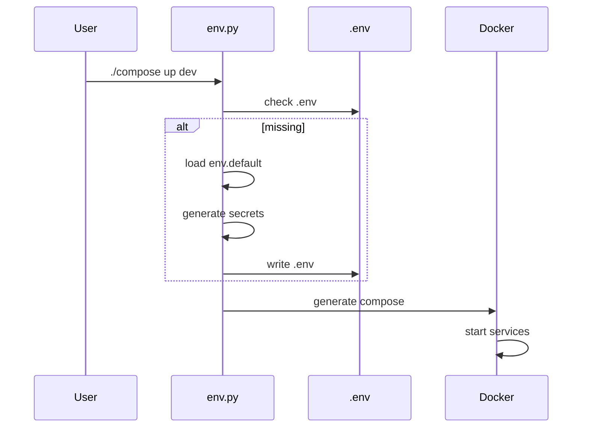
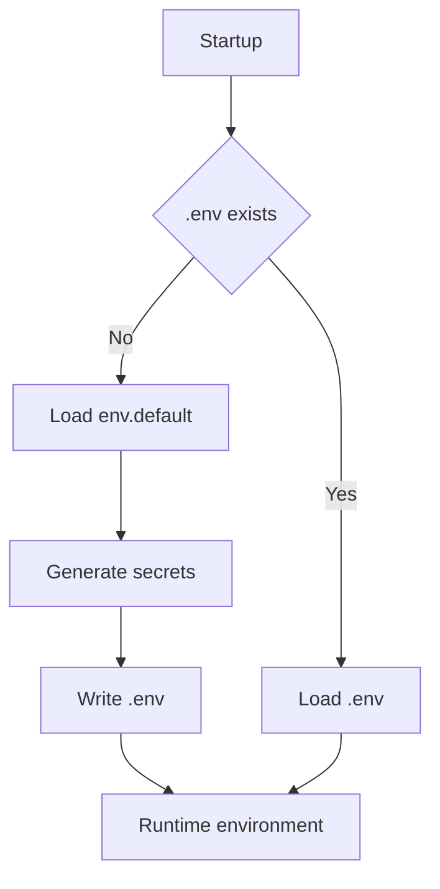

# Eugenius-Docker-n8n

Opinionated, profile-driven Docker orchestration for **local n8n development**, with optional PostgreSQL and **local LLM support via Ollama**.

This repository provides a **clean, reproducible, zero-SaaS** automation environment that works out of the box on first boot.

---

## What this project is

- A local-first n8n development stack
- Docker Compose generated programmatically for consistency
- Optional AI sidecar using Ollama (local models, no cloud)
- Profile-based service enablement (dev / heavy / minimal)

---

## Architecture Overview



---

## What this project is NOT

- A hosted SaaS or managed service
- A Kubernetes or distributed platform
- A production-hardened security solution
- A cloud-based LLM replacement

---

## Quick Start

```bash
git clone https://github.com/<your-org>/Eugenius-Docker-n8n.git
cd Eugenius-Docker-n8n
cp .env.example .env

# Edit required secrets in .env
./compose up dev
```

> On first run, a `.env` file will be generated automatically if one does not exist.

Once running:

- n8n UI: http://localhost:5678
- Ollama API (optional): http://localhost:11434

---

## Startup Lifecycle



---

## Environment Configuration (.env)

The application does **not** read environment variables directly from the shell.

### Environment Resolution Flow



`.env` is the **authoritative runtime configuration** after generation.

### How it works

- **templates/env.default**  
  Safe, non-secret defaults used for bootstrap

- **.env**  
  User-owned, authoritative configuration (gitignored)

- **.env.example**  
  Documentation-only reference of supported settings

### First run behavior

If `.env` does not exist:

1. Defaults load from `templates/env.default`
2. Required secrets are generated (dev mode only)
3. A new `.env` file is written

The file is never overwritten automatically after this point.

### Environment modes

- **dev** – auto-generate missing secrets
- **ci / prod** – fail fast if required values are missing

> Changing `N8N_ENCRYPTION_KEY` after initialization will break stored credentials.

---

## Profiles

Profiles determine which services run.

- **dev** – postgres, n8n, ollama
- **heavy** – postgres, n8n (runtime tuned)
- **minimal** – n8n only

Defined in `orchestration/constants.py`.

---

## Ollama (Local AI)

When enabled:

- Runs as a Docker sidecar
- Models stored in persistent volume
- Default model pulled automatically

Accessible from n8n at:

```
http://ollama:11434
```

Notes:

- CPU-only by default
- First startup may take time
- Performance depends on hardware

---

## Data Persistence

Docker volumes:

- `postgres_data` – database
- `n8n_data` – n8n config and credentials
- `n8n_files` – binary/workflow files
- `ollama_data` – downloaded models

Deleting volumes resets state.

---

## Mermaid Rendering Note

Mermaid diagrams render fully on GitHub. Some local Markdown previews may display simplified shapes.

---

## License

See [LICENSE](LICENSE).
